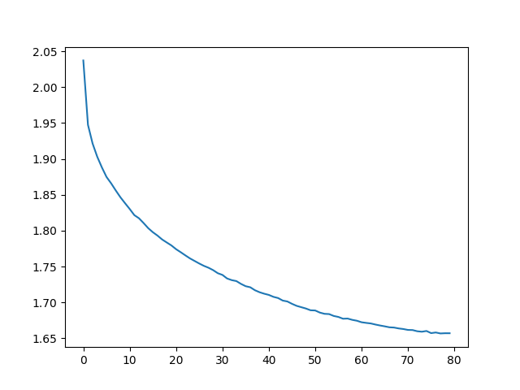
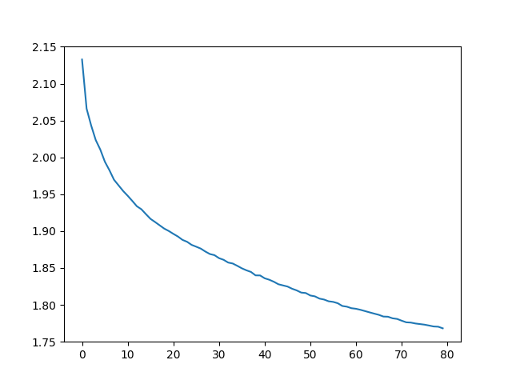
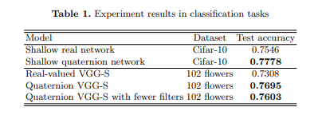
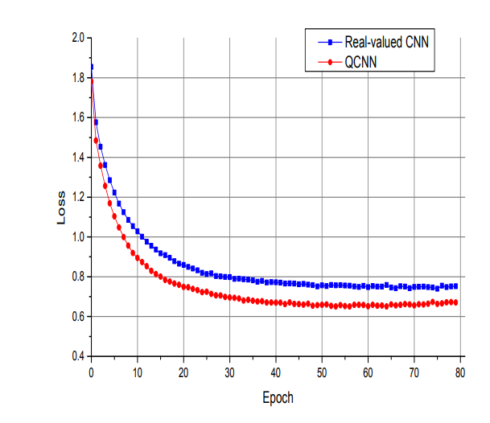

# Quaternion Convolutional Neural Networks reproduction

### Students
Jasper van Leuven, 4648404, Js.vanLeuven@student.tudelft.nl
Alexandru Bobe, 5069831, A.Bobe@student.tudelft.nl
Pieter de Lange, 4678362, P.delange@student.tudelft.nl

## Introduction
Convolutional neural networks (CNNs) are powerful tools for image recognition tasks, but they have some limitations in their ability to represent spatial rotations and orientations. Quaternion Convolutional Neural Networks (QCNNs) offer a novel solution to this problem by incorporating quaternion algebra, which enables them to more effectively model spatial rotations and orientations. QCNNs have shown promising results in a range of image recognition tasks, including object recognition, facial recognition, and even autonomous vehicle control.  

The idea of using quaternions in deep learning is not new, but it has gained momentum in recent years as researchers have looked for new ways to overcome the limitations of traditional CNNs. Quaternions are a type of hypercomplex number that extends the idea of complex numbers to four dimensions. They are commonly used in physics and engineering to represent rotations and orientations, and they have been shown to be useful in a range of applications, including computer vision.  

In this blog post, we will focus on our reproduction of the paper "Quaternion Convolutional Neural Networks" by Zhu et al. (2019). This paper introduces the use of QCNNs for image recognition tasks, and demonstrates their effectiveness on a range of datasets. Use will be made of existing QCNN layers and their performance on the CIFAR-10 dataset will be evaluated. In the following sections, we will provide an overview of the problem at hand, a short description of the dataset we will be working with, the methodology used in the reproduction with their final results.  

## Overview of the problem
The problem the authors of the paper are addressing is the limited performance of CNNs and they propose to improve on this by introducing QCNN. To assess the increase in performance, results from two dinstinct tasks between the real-valued CNN and QCNN are compared. Color image classification and color image denoising will be performed by the networks. In the paper, the CIFAR-10 and 102 flowers datatsets were used for this comparison. For the reproduction, only the CIFAR-10 dataset is used.

## Dataset
The CIFAR-10 dataset is a commonly used benchmark dataset for image recognition tasks. It consists of 60,000 32x32 color images in 10 classes, with 6,000 images per class. The classes are as follows:  
  
1. airplane
2. automobile
3. bird
4. cat
5. deer
6. dog
7. frog
8. horse
9. ship
10. truck  


The dataset is split into 50,000 training images and 10,000 test images. The training images are used to train the model, while the test images are used to evaluate the performance of the model. The dataset is labeled, which means that each image is assigned a class label indicating which of the 10 categories it belongs to.

The CIFAR-10 dataset is considered a challenging benchmark dataset because the images are relatively small (32x32 pixels), which makes it difficult to distinguish between some of the classes. Additionally, the dataset includes many examples of objects that are visually similar, such as different breeds of dogs or types of birds.

The dataset has been used to evaluate the performance of a wide range of image recognition models, including both traditional CNNs and newer approaches such as QCNNs. Because the dataset is widely used and well-known in the field, it provides a useful benchmark for comparing the performance of different models on a common set of tasks.


## Method
In this section we describe the pre-processing steps, the network architecture and finally the training method used for the QCNN. This has all been performed in Python, making use of PyTorch, Torchvision and the core_qnn function that is publicly available.

### Pre-processing
The steps taken in the pre-processing phase are the following:  
1. Load the CIFAR-10 dataset, which consists of 50,000 training images and 10,000 test images.  

2. Preprocess the images in the training and test datasets by applying a series of transformations to them. These transformations include things like random affine transformations (to augment the dataset), horizontal flipping, conversion to a tensor, and normalization. The purpose of these transformations is to prepare the data for use with the QCNN model by ensuring that all images have the same size, shape, and range of values.  

3. Convert the preprocessed RGB images to the four-channel format expected by the QCNN model. This involves concatenating the original RGB image with a zero-filled grayscale image (which has the same dimensions as the RGB image) to create a new four-channel image. The four channels consist of three for the RGB channels and one for the quaternion channel.  

4. Use the preprocessed, four-channel images as input for the QCNN model.  

Overall, the goal of this code is to prepare the CIFAR-10 dataset for use with the QCNN model by converting the images to the appropriate format and applying a series of transformations to ensure that the data is well-suited for training and testing the model.

### Architecture
Two different modules are defined within the script, which contain the layer architectures of the quaternion network and the real-valued network. The modules are called *TheModule* and *CNNModule* and consist of the following:

- TheModule is a neural network architecture that consists of nine layers, including two *QuaternionConv* layers, two linear layers, and some pooling and dropout layers. The input to the network is a 4-channel tensor, and the first two layers of the network are *QuaternionConv* layers, which perform convolution on the input tensor using Quaternion kernels. The output of each of these two layers is then passed through a ReLU activation function. After the second *QuaternionConv* layer, the output is fed into a max-pooling layer that reduces the spatial dimensions of the tensor by a factor of two. The resulting tensor is then flattened and passed through a linear layer, which is followed by another ReLU activation function. The output of this layer is then fed into another linear layer, which is followed by a sigmoid activation function. Finally, the output of this layer is the predicted probability distribution over the ten classes. Overall, the architecture of TheModule is similar to that of a regular CNN, but it replaces some of the layers with Quaternion layers to enable processing of quaternion inputs.  

- CNNModule: In order to do a comparative analysis, this module is created as an exact copy of *TheModule* described above. The difference is that the QuaternionConv layers are now replaced by the regular (real-valued) *nn.Conv2d* layers. The inputs of the network are 3-channel (RGB) images of a fixed size, which are passed through the layers to produce a probability distribution over the predefined 10 classes. 

The modules use PyTorch's *nn.Module* class as a base class, and implement a *forward()* method that defines the computation graph for the network. The *forward()* method takes an input tensor and passes it through the layers of the network, using various activation functions to produce the final output. Each module also has a *name()* method that returns a string with the name of the module.

### Training
After having developed the network architectures as described above, they can be trained using a dedicated script. The training process begins with setting the number of epochs to be trained, which is 80 in this case. A list called "losses" is initialized to store the training loss values. The training loss represents the difference between the predicted output and the actual label of each training example, and it is used to optimize the network's parameters.  

The code then starts a loop over each epoch. Within each epoch, the running loss is initialized to zero. The training data is then passed through the network in mini-batches, where each batch contains a fixed number of training examples. The inputs and labels of each batch are loaded onto the GPU, and the gradient of the loss function with respect to the network's parameters is computed using the backward propagation algorithm. The optimizer then updates the network's parameters based on the computed gradient, which minimizes the loss.  

The running loss is then updated by adding the loss of each mini-batch to it, and the statistics are printed after every epoch. The losses list is also updated by taking the average of the running loss of each epoch. This process is applicable to the quaternion module as well as to the real-valued module.

## Results

### QCNN Cifar-10
Below are the results of our QCNN model, ran on the cifar-10 dataset:

#### 65% 
This was the first result we got that came close to the paper. We went from 10% accuracy to this accuracy by changing the way we preprocess the data. This is done in the 
``` convert_data_for_quaternion(batch) ``` function. This was achieved with the following hyperparameters:
+ normalization
+ no data augmentation
+ 80 training epochs
+ batch size = 32

#### 67% 
We increased our accuracy by adding the following data augmentation techniques (as described in the paper):
+ ```transforms.RandomAffine(degrees=0, translate=(0.1, 0.1))```
+  ```transforms.RandomHorizontalFlip()```

#### 68.5%
By changing the way we preprocess the data:
+ From ```inputs.append(torch.cat([batch[i][0], grayscale(batch[i][0]).size()], 0)) ```
+ to ```inputs.append(torch.cat([batch[i][0], torch.zeros(grayscale(batch[i][0]).size())], 0))```

**Here we realised that the model from the repository linked on Arxiv: https://github.com/XYZ387/QuaternionCNN_Keras has a different architecture than the one described in the paper:**

#### 73.14% paper architecture QCNN
Model without dropout, normal fullyconnected layers as proposed in the paper and no normalization: 

If we want to load the data of this model, it is called: 28_18_5_29_As_proposed_in_the_paper 

Normal fully connected layers instead of Quaternion fully connected layers are performing better.



#### Other runs:
##### 42.2800%
Achieved using normalization of one and no filliping horizontal flipping on the test set

### CNN Cifar-10
Below are the results of our cifar-10, when ran with the CNN model:

#### 60.3100% 
Normal CNN with excact as many filters as the QCNN and twice as few parameters: 



## Discussion

The table that needs to be repoduced is depicted below. However our test results seem to diverge from this table. *We are wondering if it is smart to keep on trying to achieve the 0.77 for the QCNN and 0.75 CNN or that it is smart to try and move on to other criteria (larger dataset, ablation study, hyperparameters check etc.)*.




We were also wondering why it seems that our CNN performs so much worse and looking at our graphs vs those in the paper down below, our loss does not match at all, and we learn slower.



## Conclusion

The paper clearly states that by using QCNNs, a significant difference of 3 to 4 percent can be achieved in terms of accuracy. After extensive searching, we have found that QCNN does indeed perform better than CNN, but the difference was not as large as stated in the paper.  

The results we have obtained are even higher on average than those discussed in the paper, and we believe this is because our networks have more parameters than those in the paper. The paper does not clearly indicate how many kernels each layer has, which forced us to puzzle it out ourselves. So we were able to reproduce the results to some extent, and the results are consistent, but the differences are not as significant in our case.  

As mentioned, we believe that the difference in the achieved accuracy is due to the number of hyperparameters in our networks, and we also believe that the difference between the two networks in terms of accuracy largely depends on the data preprocessing. The paper uses techniques such as horizontal flipping and translating, but the hyperparameters for these techniques are not discussed. It could be that the QCNN responds better to these preprocessing techniques, and that the hyperparameters in the paper have caused these significant differences.  

With these results, we can conclude that QCNN performs slightly better than CNN, but the paper could have specified which hyperparameters were used exactly.
